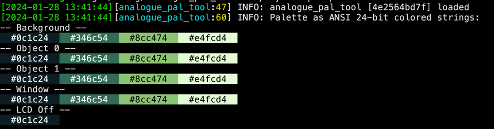
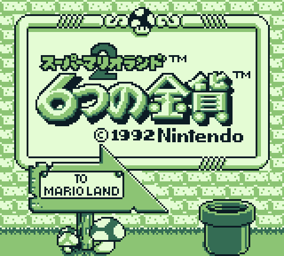
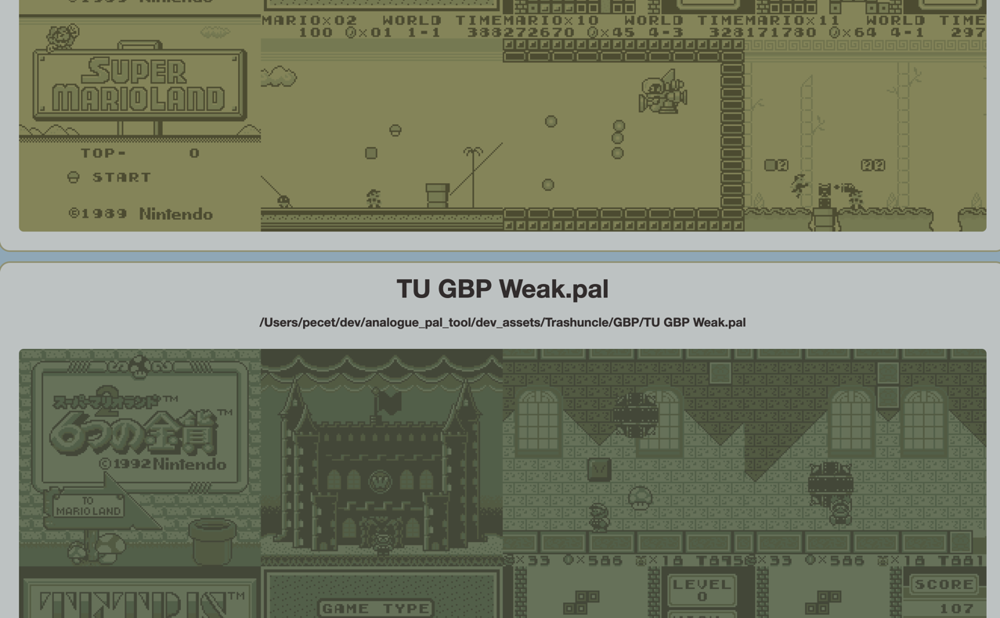

# Analogue Pal Tool

Simple over-engineered tool for generating PAL color palettes from images. 

## Usage examples
Prebuilt binaries are TODO. For now use [cargo from Rust](https://www.rust-lang.org/tools/install) to build and run.

* Display full help:
    ```
    cargo run -- --help
    ```
* Display palette from .pal file in terminal (it must support 24-bit color obviously, use good terminal emulator like [Kitty](https://sw.kovidgoyal.net/kitty/) or [Alacritty](https://alacritty.org/))
    ```
    cargo run -- --palette palette.pal
    ```
  
* Create template .pal file:
  ```
  cargo run -- create-template-pal -o template.pal
  ```
  Use generate .pal file while taking screenshots on Analogue Pocket (Analogue + Start button combination). This palette does not look good, but will allow you to use next option
* Colorize and scale (x3) .png image created using template .pal file:
  ```
   cargo run -- colorize-image -s 3 --pal example.pal --output output.png 20240105_212250.png 
  ```
  It will generate file similar to this: 
* Colorize multiple images using multiple .pal files and generate HTML summary file:
```
cargo run -- colorize-image -t -m -s 3 -o 'dev_assets/output/test2.png' -p '/Users/pecet/dev/analogue_pal_tool/dev_assets/Trashuncle/GBP/**/*.pal' '/Users/pecet/dev/analogue_pal_tool/dev_assets/ScreenShots/*.png'
```
   It will generate output.html (currently not configurable) in current directory containing all images and palette combinations. So basically you can preview any palettes you have using this. Example part of output from this command (html):
    

## TODO
* [ ] Add prebuilt binaries
* [ ] Add option to use convert images back to palettes (images are already generated as PNG files with 8-bit palette so this should be easy)
* [ ] Add LUA scripting support for palette manipulation because why not


